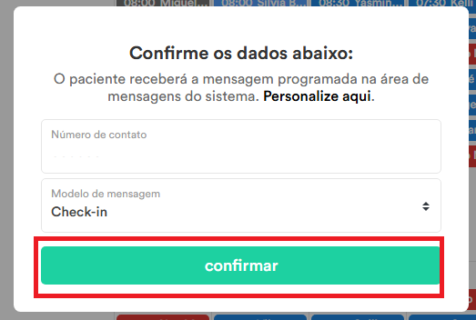

# Envio de check-in para pacientes

***Para o envio de check-in deverá ser pego todos os pacientes que foram atendidos há 30 dias atrás. Esse processo deverá ser feito diariamente. Não pode ser enviado mensagem duplicada para os pacientes no mesmo dia, para isso, todos os contatos são salvos em um excel do dia atual, com o número de telefone, data de envio de mensagem e o status do envio. Através desse excel, é validado se o paciente já recebeu a mensagem ou não. Se ele recebeu, não envia novamente e vai para o próximo. Se ele não recebeu, segue o processo normalmente***.

## Passo a passo do processo realizado

### Passo 1

### Passo 2

### Passo 3

### Passo 4

### Passo 5

### Passo 6

### Passo 7

### Passo 8

### Passo 9

### Passo 10

Nessa etapa é realizada a validação para saber se o número de telefone já foi processado ou não. Para isso, é lido um excel do dia atual, com o número de telefone, data de envio de mensagem e o status do envio. Através desse excel, é validado se o paciente já recebeu a mensagem ou não. Se ele recebeu, não envia novamente e vai para o próximo. Se ele não recebeu, segue o processo normalmente  

### Passo 11

### Passo 12

